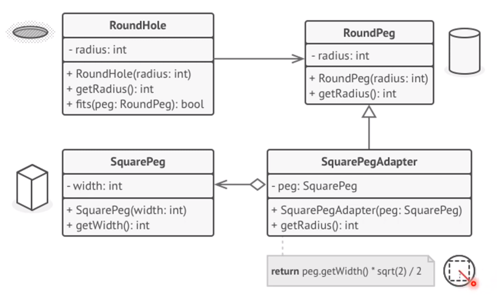

# Adapter Design Pattern

Adapter is a structural design pattern that allows objects with incompatible interfaces to collaborate. <br>
    

### Problem
- Stock market application
- Download data - charts and diagrams
- 3rd party analytics library <br>
  

### Solution
**Adapter**: a special object that converts the interface of one object so that another object can understand it. <br>
    

### Working of Adapter
Adapters cannot only convert data into various formats but can also help objects with different **interfaces collaborate**.
1. The adapter **implements an interface**, compatible with one of the existing objects.
2. Using this interface, the **existing object** can safely call the **adapter's methods.**
3. Upon receiving a call, the adapter **passes the request to the service object,** but in a format and order tha the service object expects. <br>
    Existing Object 👉 Adapter 👉 Service Object

### Structure of Adapter Pattern
- **Client** (Class - existing business logic)
- **Client Interface**: protocol that other classes must follow to be able to collaborate with the client code.
- **Service**: some useful class. The client can't use this class directly; incompatible interface.
- Client 👉 Adapter 👉 Service: it implements the client interface, while wrapping the service object
- The adapter **receives calls** from the client via the adapter interface and **translates** them into calls to the service object in a format it can understand.
- Client works with Adapter _via the Client Interface_ - new types of adapters without breaking the existing client code
- This can be useful when the **interface of the service class gets changed** or replaced. <br>
  

### Steps to Implement
You have at least two classes with incompatible interfaces:
1. A useful _service class_ (unchangeable), often 3rd-party, legacy or with lots of existing dependencies and
2. One or several client classes that would benefit from using the service class.

#### Steps
1. Declare the **client interface** and describe how clients communicate with the service.
2. Create the **adapter class** and make it **follow the client interface**. Leave all the methods empty for now.
3. Add a **field to the adapter class** to store a reference to the service object. The common practice is to initialize this field via the constructor, but sometimes it's more convenient to pass it to the adapter when calling its methods.
4. One by one, **implement all methods** of the client interface in the **adapter class.** The adapter should delegate most of the real work to the service object, handling only the interface or data format conversion.
5. Clients should **use the adapter via the client interface.** This will let you change or extend the adapters without affecting the client code.

### UML Diagram of Example Code


### Example
#### RoundHole
```java
public class RoundHole {
    private Double radius;
    
    public RoundHole(Double radius) {
        this.radius = radius;
    }
    
    public double getRadius() {
        return radius;
    }
    
    public boolean fits (RoundPeg peg) {
        boolean result;
        result = (this.getRadius() >= peg.getRadius());
        return result;
    }
}
```

#### RoundPeg
```java
public class RoundPeg {
    private Double radius;
    
    public RoundPeg() {}
    
    public RoundPeg(Double radius) {
        this.radius = radius;
    }
    
    public Double getRadius() {
        return radius;
    }
}
```

#### SquarePeg
```java
public class SquarePeg {
    private Double width;
    
    public SquarePeg(Double width) {
        this.width = width;
    }
    
    public Double getWidth() {
        return width;
    }
    
    public Double getSquare() {
        Double result;
        result = Math.pow(this.width, 2);
        return result;
    }
}
```

#### SquarePegAdapter
```java
public class SquarePegAdapter extends RoundPeg {
    private SquarePeg peg;
    
    public SquarePegAdapter(SquarePegAdapter peg) {
        super();
        this.peg = peg;
    }
    
    @Override
    public Double getRadius() {
        Double result;
        result = Math.sqrt(Math.pow(peg.getWidth()/2, 2)*2);
        return result;
    }
}
```

#### Main
```java
public class Main {
    public static void main (String[] args) {
        RoundHole hole = new RoundHole(5);
        RoundPeg roundPeg = new RoundPeg(5);
        if(hole.fits(roundPeg)) {
            System.out.println("Round peg r5 fits round hole r5");
        }
        
        SquarePeg smallSqPeg = new SquarePeg(2);
        SquarePeg largeSqPeg = new SquarePeg(20);
        //hole.fits(smallSqPeg); --> won't compile
        
        //Adapter solves the problem
        SquarePegAdapter smallSqPegAdapter = new SquarePegAdapter();
        SquarePegAdapter largeSqPegAdapter = new SquarePegAdapter();
        
        if(hole.fits(smallSqPegAdapter)) {
            System.out.println("Square peg w2 fits round hole r5.");
        }
        if(!hole.fits(largeSqPegAdapter)) {
            System.out.println("Square peg w20 does not fit into round hole r5.");
        }
    }
}
```

### Applicability
Use the adapter pattern when you want to **use some existing class,** but its **interface isn't compatible** with the rest of your code. <br>
Allows objects with incompatible interfaces to collaborate.

