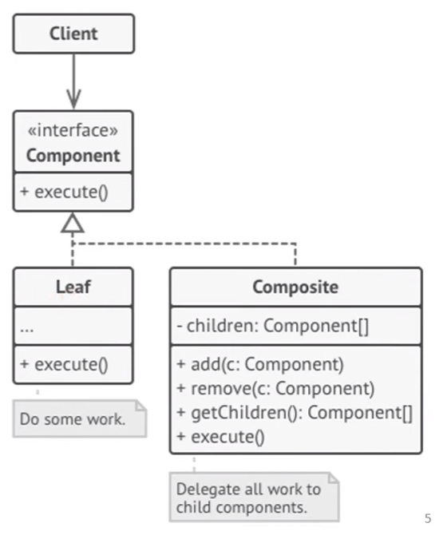
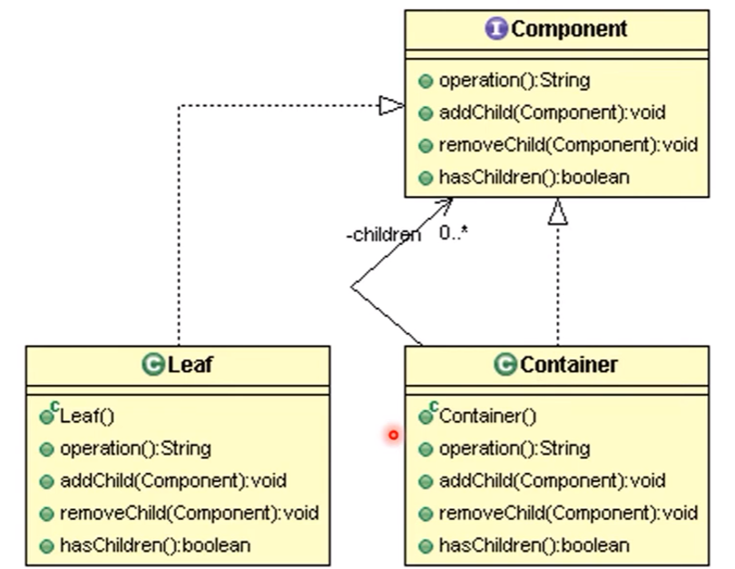

# Composite Design Pattern

Composite is a structural design pattern that lets you compose objects into tree structures and then work with these structures as if they were individual objects.

### Problem

### Structure of Composite Pattern
- **Component** _(interface)_: operations common to both simple and complex elements of the tree.
- **Leaf**: a basic element of a tree that doesn't have sub-elements, real work
- **Container** _(aka composite)_: element that has sub-elements; leaves or other containers - works with them using the Component Interface
- **Client**: works with all elements through the component interface; can work with a container or a leaf.
    

### Steps to Implement
Make sure that the core model of your app can be represented as a **tree structure** - leaves and containers
1. Declare the **Component** interface with a list of methods that make sense for both simple and complex components.
2. Create a **Leaf** class to represent simple elements. A program may have multiple _different leaf classes._
3. Create a **Container** class to represent complex elements. An array field for storing references to children - array of component a container delegates most of its work to its children.
4. Define the methods for **adding** and **removing** the child elements in the Container class - empty implementation in Leaf class - _Interface Segregation Principle_ <br>
    


### Example
#### Component
```java
public interface Component {
    String operation();
    void addChild(Component child);
    void removeChild(Component child);
    boolean hasChildren();
}
```

#### Leaf
```java
public class Leaf implements Component {
    @Override
    public String operation() {
        return "Leaf";
    }
    
    @Override
    public void addChild(Component child) {
        //no implementation
    }
    
    @Override
    public void removeChild(Component child) {
        //no implementation
    }
    
    @Override
    public boolean hasChildren() {
        return false;
    }
}
```

#### Container
```java
public class Container implements Component {
    private List<Component> children = new ArrayList<>(); 
    
    @Override
    public String operation() {
        int i = 0;
        String result = "Branch (";
        for(Component child: children) {
            result += child.operation();
            if(i != children.size() - 1) {
                result += "+";
            }
            i++;
        }
        return result + ")";
    }

    @Override
    public void addChild(Component child) {
        children.add(child);
    }

    @Override
    public void removeChild(Component child) {
        children.remove(child);
    }

    @Override
    public boolean hasChildren() {
        return true;
    }
}
```

#### Main
```java
public class Main {
    public static void main (String args[]) {
        Leaf leaf = new Leaf();
        System.out.println("Client: I've created a simple component.");
        System.out.println(leaf.operation());
        
        Container tree = new Container();
        Container branch1 = new Container();
        branch1.addChild(new Leaf());
        branch1.addChild(new Leaf());
        
        Container branch2 = new Container();
        branch2.addChild(new Leaf());
        
        tree.addChild(branch1);
        tree.addChild(branch2);
        
        System.out.println("Client: Now I've created a composite tree.");
        System.out.println(tree.operation());
    }
}
```

### Applicability
Use the composite pattern when:
- you have to implement a **tree-like** object structure.
- you want the client code to treat both simple and complex elements uniformly.

